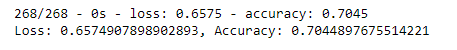
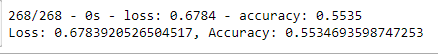
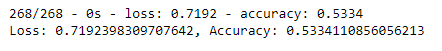
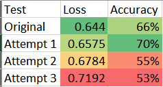

# Neural_Network_Charity_Analysis

## Overview of the analysis:

The purpose of this analysis is to design a deep neural network machine learning model that can successfully predict whether applicants would be successful if funded by Alphabet Soup (a charity foundation). The data used contains various information from the Application type and Name of applicants to the Income amount as well as the Is Successful column which is our target column. The deep neural network model does require some preprocessing of the dataset first so half of the coding is dedicated to cleaning the data and the other half contains several tests ran to boost accuracy as close to 75% as possible. 

## Results 

### Data Preprocessing

**What variable(s) are considered the target(s) for your model?**

The variable that was considered as the target for my model was the Is_Successful column since we want the machine to predict which applicant was successful or not.

**What variable(s) are considered to be the features for your model?**

The features used for the model were Application_Type, Affiliation, Classification, Use_Case, Organization, Status, Income_Amount, Special_Considerations and Ask_Amount. Columns that contained large amounts of unique values would be bucketed into an Other category to simplify the data. Additionally, columns that contained strings were converted into binary code in order for the test to be performed.

**What variable(s) are neither targets nor features, and should be removed from the input data?**

The variables that were removed from the dataset were the EIN and Name column since these were simple identifications for either the applicant or application and did not carry any weight toward helping with the model's predictions.

### Compiling, Training, and Evaluating the Model

**How many neurons, layers, and activation functions did you select for your neural network model, and why?**

For the original test I performed, I chose to use 2 hidden layers containing 8 and 5 neurons respectively and Rectified Linear Unit (Relu) as the activation function. The test would run for 100 epochs. I wanted to start with a deep neural network so that there would a strong attempt on its predictive accuracy. Relu fit as the activation function since we had no values within our data containing negative numbers. 

**Were you able to achieve the target model performance?**

No. On the original attempt, I was only able to achieve 66% predictive accuracy while the target was 75%.

**What steps did you take to try and increase model performance?**

Since boosting the accuracy of the model is trial and error, I attempted 3 different methods of boosting its predictive accuracy.

On attempt 1, I increased the number of neurons in each layer from 8 and 5 to 12 and 6 respectively. During this attempt, I achieved 70% predictive accuracy.

For attempt 2, I kept the neurons the same as before with 8 and 5 respectively, but I increased the number of epochs from 100 to 300. This resulted in 55% predictive accuracy.

On the last attempt, I decided to add a third hidden layer. Our total count for neurons was hidden layer 1 = 12, hidden layer 2 = 6, hidden layer 3 = 3. After running my test, it scored 53% predictive accuracy.

## Summary

Overall, the deep learning model performed decently well when predicting if an applicant would be successful if funded by Aplhabet Soup despite it not reaching 75%. As we can see from the table above, the attempt where I added more neurons to hidden layers 1 and 2 turned out to be the most successful in terms of predictive accuracy even if the loss was a tad higher than the original attempt. If given more time, I would probably experiment with attempt 1 some more by dropping more feature columns from the dataset such as the Application Type and Classification columns and re-running the test.

Would using a deep learning model be the best choice here? Probably not. I think a simpler but better alternative for this dataset would be the Random Forest model. Random Forest does a great job with handling large tabular data like our charity dataset which contains over 34,000 rows of data and is much easier to run trial and error results due to how quick it is. When running each test for the deep learning model, it took close to a minute to generate test results which can get frustrating when experimenting with all of the optimization methods. It would make sense to stay simple with the Random Forest instead of building an entire neural network. 
